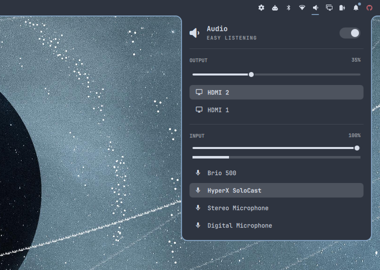

# Fillet

Attaches every bar popup flush to the Omarchy bar, with fillet curves that
sweep out into it — so bar and popups read as one surface instead of a bar
with cards floating below it.



A *fillet* is the concave rounded transition where two surfaces meet. That is
all this plugin adds: the shape. Every colour comes from the active Omarchy
theme (popup background, popup border, corner radius), so it follows theme
switches automatically.

## What it changes

For every popup built on Omarchy's `KeyboardPanel` (audio, network,
Bluetooth, power, clock, weather, and third-party widgets using the same
base):

- the gap between bar and popup is removed;
- the edge touching the bar is square, only the exposed corners are rounded;
- two fillet curves join the popup's top corners to the bar;
- the outline is drawn on the exposed edges only, never between bar and popup.

Optionally, a line in the same colour runs along the bar's inner edge, so the
bar and its popups share one continuous frame.

Nothing is written to your configuration. The plugin restyles popups in memory
while the shell runs; disable or remove it and the stock look is back.

## Install

```bash
omarchy plugin add https://github.com/xtrimsystems/omarchy-fillet.git --enable
```

Fillet is an invisible, zero-width bar widget. When asked where to place it,
any section is fine — it only needs to be on the bar.

## Settings

Omarchy Settings → Plugins → Fillet:

| Setting | Default | Meaning |
| --- | --- | --- |
| Fillet radius | 12 px | Radius of the curves into the bar and of the exposed popup corners |
| Outline | on | Stroke the exposed popup edges in the theme's popup border colour |
| Bar edge line | on | Draw the same line along the bar's inner edge |

Or from a terminal:

```bash
omarchy bar set io.github.xtrimsystems.fillet seamRadius 16
omarchy bar set io.github.xtrimsystems.fillet outline false
omarchy bar set io.github.xtrimsystems.fillet barEdge false
```

## Remove

```bash
omarchy plugin remove io.github.xtrimsystems.fillet
```

## Limitations

- Popups built on `PopupCard` rather than `KeyboardPanel` (the system tray,
  the media player) keep the stock look.
- On left/right bars popups attach flush with a square edge, but without the
  fillet curves or the bar edge line.
- The plugin reaches into the shell's popup internals at runtime. It matches
  them by shape rather than by name, but an Omarchy update that restructures
  popups can stop it applying. When that happens popups simply fall back to
  the stock look; nothing breaks.

## Dependencies

None beyond Omarchy itself (Quickshell with `QtQuick.Shapes`, which Omarchy
already ships).

## Credits

The idea comes from [Lacuna Shell](https://github.com/OldJobobo/lacuna-shell)
and its design principle *"show the seam"*. Fillet borrows only that idea,
for the stock Omarchy bar.

## License

[MIT](LICENSE)
